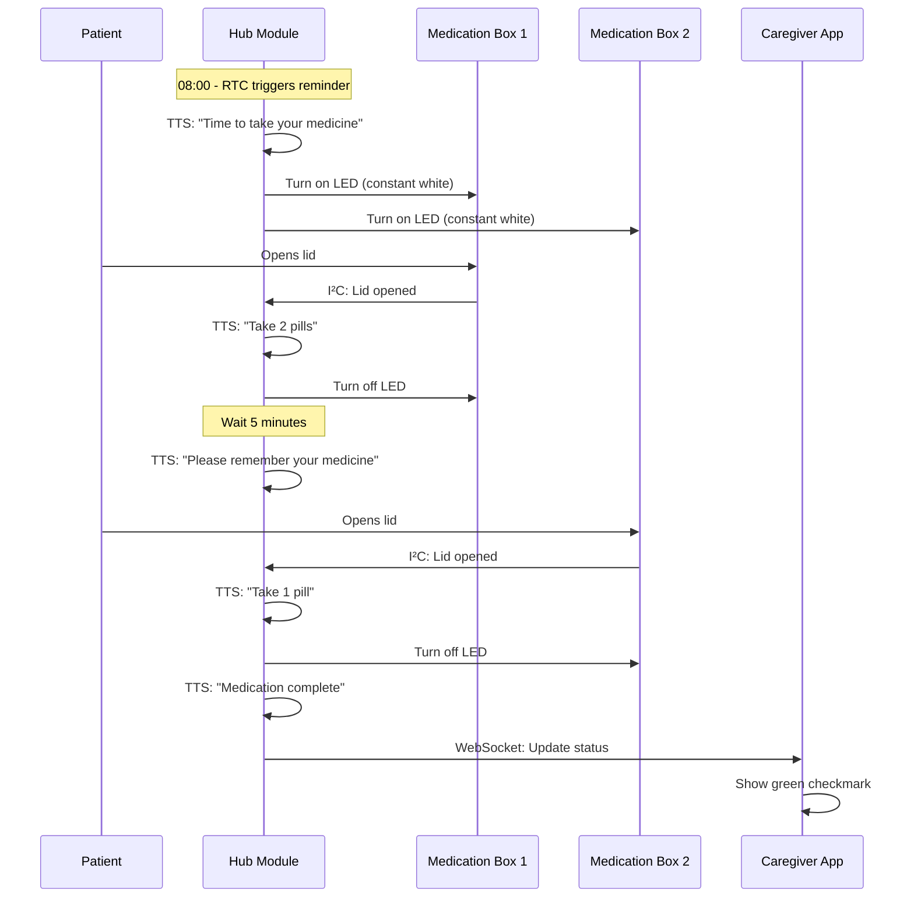
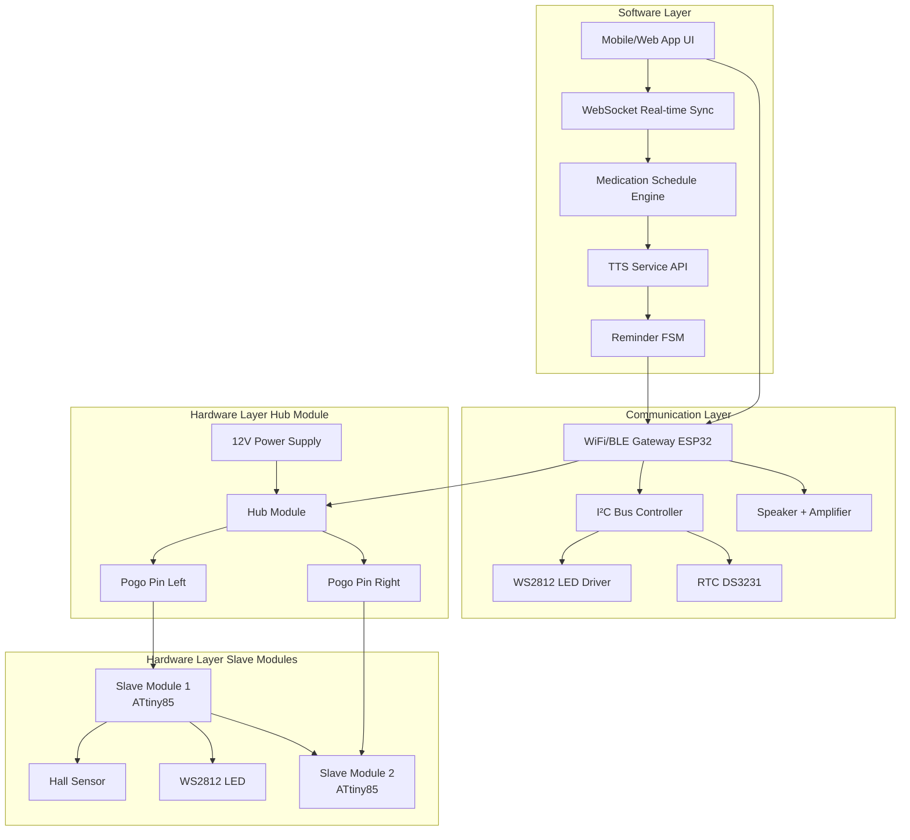
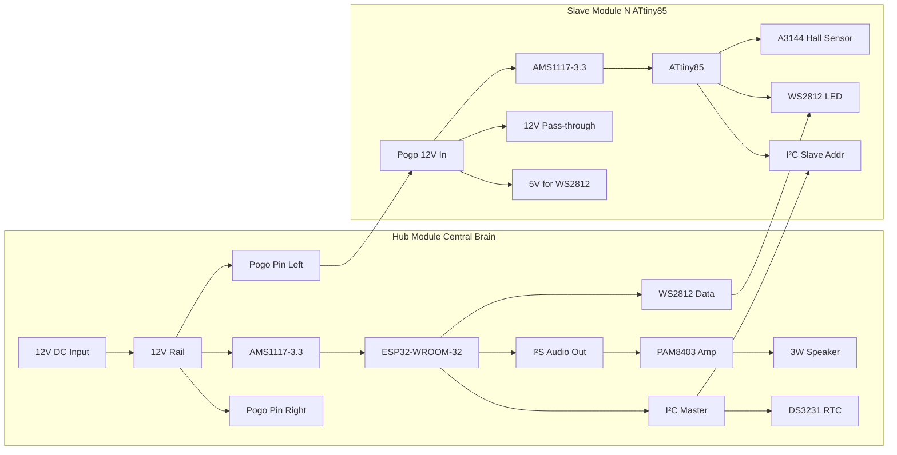
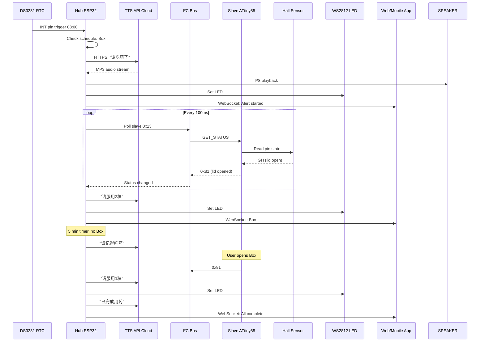
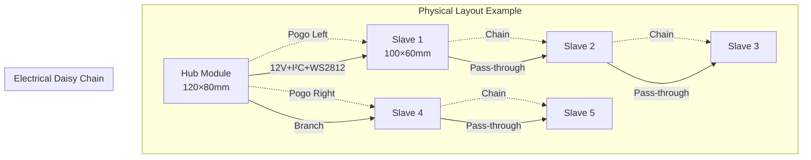
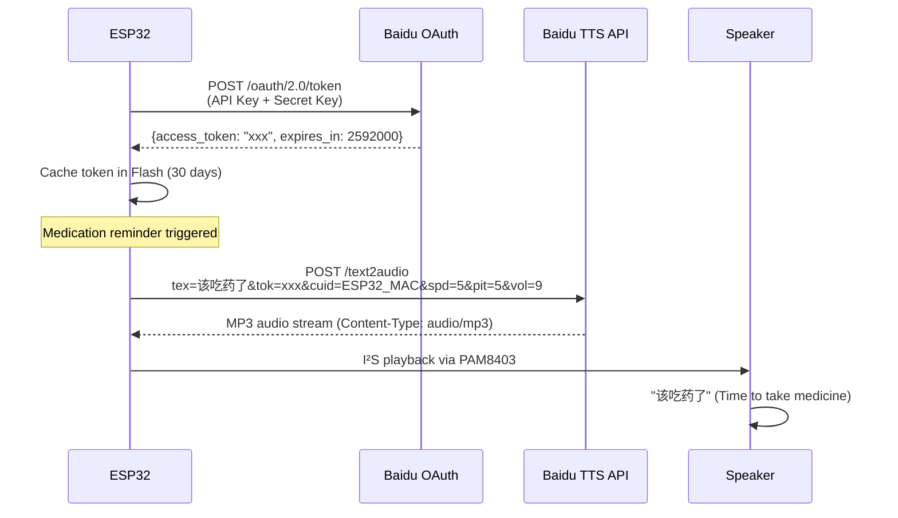
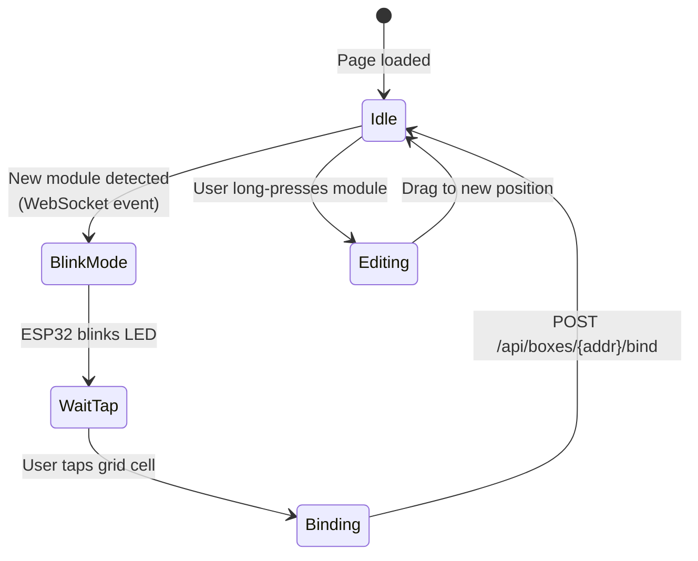

# Modular Smart Pillbox - Complete Architecture Specification v2.0
# 阿尔兹海默症智能药箱完整架构规范

**Document Status**: Production-Ready Technical Blueprint (Alzheimer's Care Enhanced)  
**Version**: 2.0  
**Date**: 2026-03-02  
**Author**: Hardware Architecture Team  
**Classification**: Technical Specification  
**Base Version**: v1.0 (General Modular Pillbox)  
**Enhancement**: Alzheimer's Patient Medication Management Features

---

## Document Change Summary (v1.0 → v2.0)

### New Features Added
- ✨ Hub-Slave architecture with centralized intelligence
- ✨ RTC-based timed medication reminders
- ✨ Voice announcement system (TTS online synthesis)
- ✨ Lid-open detection via Hall effect sensor
- ✨ 5-minute reminder repetition logic
- ✨ ATtiny85 firmware for slave modules
- ✨ Web-based UI with medication scheduling

### Preserved from v1.0
- ✅ 12V high-voltage transmission + LDO regulation
- ✅ WS2812B addressable LED chain
- ✅ I²C communication bus
- ✅ Pogo Pin magnetic interconnect (4-pin，已移除 WS2812 数据线)
- ✅ Blink-to-Identify spatial mapping

### Modified Components
- 🔄 Main controller → Hub module (added RTC, speaker, amplifier)
- 🔄 Slave module → ATtiny85 MCU (from "provisional" to confirmed)
- 🔄 Door sensor → Hall effect sensor A3144 (from reed switch)

---

## Table of Contents

1. [Product Overview](#1-product-overview)
2. [System Architecture](#2-system-architecture)
3. [Core Technical Selection](#3-core-technical-selection)
4. [Spatial Mapping Interaction](#4-spatial-mapping-interaction)
5. [Bill of Materials & Cost Estimation](#5-bill-of-materials--cost-estimation)
6. [Firmware Architecture](#6-firmware-architecture)
7. [UI Frontend Design](#7-ui-frontend-design)
8. [Technical Risks & Mitigation](#8-technical-risks--mitigation)
9. [Development Roadmap](#9-development-roadmap)
10. [Appendix](#10-appendix)

---

## 1. Product Overview

### 1.1 Core Value Proposition (Enhanced for Alzheimer's Care)

The **Modular Smart Pillbox v2.0** is a specialized medication management system designed for **Alzheimer's patients and elderly care**, featuring:

- **Voice-guided reminders**: "Time to take your medicine" with dosage instructions
- **Mandatory lid-open confirmation**: Prevents forgotten doses
- **Visual + auditory alerts**: LED indicators + speaker announcements
- **Caregiver oversight**: Web UI for remote monitoring and history tracking
- **Modular scalability**: Adapts to complex medication regimens (5-30 modules)

**Primary Innovation**: Combines physical-digital interaction with cognitive assistance—the system actively guides patients through medication routines, reducing reliance on memory.

### 1.2 Target User Scenarios (v2.0)

| User Profile | Use Case | Module Count | Key Requirements |
|-------------|----------|--------------|------------------|
| **Alzheimer's Patient (Mild)** | Independent living with reminders | 5-10 modules | Voice guidance, simple UI for family |
| **Alzheimer's Patient (Moderate)** | Home care with caregiver supervision | 10-15 modules | Mandatory confirmation, history logs |
| **Elderly Care Facility** | Multi-patient medication cart | 20-30 modules × N patients | Clear labels, centralized monitoring |
| **Post-surgery Recovery** | Temporary complex regimen | 8-12 modules | Flexible scheduling, discharge planning |

### 1.3 Clinical Interaction Flow

**Scenario**: 80-year-old patient with Alzheimer's, prescribed 3 medications at 8:00 AM



### 1.4 Key Performance Indicators (v2.0 Updates)

| Metric | Specification | Validation Method |
|--------|--------------|-------------------|
| **Voice Clarity** | >95% word recognition at 2m distance | User testing with elderly participants |
| **Reminder Reliability** | <0.1% missed reminders (RTC accuracy) | DS3231 ±2ppm specification |
| **Lid Detection Accuracy** | >99.5% correct open/close events | 1000-cycle test with Hall sensor |
| **TTS Latency** | <3 seconds from trigger to speech | WiFi + API response time measurement |
| **Battery Backup (RTC)** | 3+ years on CR2032 coin cell | DS3231 battery consumption spec |
| *(All v1.0 KPIs preserved)* | - | - |

---

## 2. System Architecture

### 2.1 Three-Layer Architecture Overview (v2.0)



### 2.2 Hardware Architecture Diagram (v2.0 Enhanced)



### 2.3 Data Flow Architecture (Medication Reminder Cycle)



### 2.4 Physical Module Configuration (v2.0 Hub-Centric)



### 2.5 System Role Architecture (NEW)

#### 2.5.1 Hub Module (Central Controller)

**Hardware Responsibilities**:
- **Power Distribution**: 12V DC input (wall adapter) → distribute to all slave modules
- **Timing Management**: DS3231 RTC maintains schedule even when WiFi disconnected
- **Audio Output**: TTS synthesis → I²S DAC → PAM8403 amplifier → 3W speaker
- **Network Connectivity**: ESP32 WiFi connects to cloud TTS + Web UI backend
- **Bus Master**: I²C master polls slave modules every 100ms, sends LED commands

**Software Responsibilities**:
- Schedule engine: Load medication times from Flash, compare with RTC
- Reminder FSM: State machine for alert → wait → repeat → complete cycle
- TTS integration: HTTP client for Baidu/Xunfei TTS API
- WebSocket server: Real-time status push to caregiver app
- LED orchestration: Translate "which boxes" to WS2812 chain addresses

**Physical Placement**: Central position in layout, always powered on

#### 2.5.2 Slave Module (Medication Container)

**Hardware Responsibilities**:
- **Local Sensing**: Hall effect sensor detects lid open/close (3-5mm magnet distance)
- **Status Indication**: WS2812 LED controlled by hub (white=take medicine, off=done)
- **Power Pass-through**: Pogo Pin daisy-chain to next module
- **I²C Slave**: Responds to hub's status queries and command writes

**Software Responsibilities** (ATtiny85 firmware):
- I²C slave protocol: Listen on assigned address (0x10-0x1F)
- Hall sensor polling: 50Hz sampling, debounce lid state changes
- Status reporting: When hub queries, return 8-bit status byte
- LED control: Receive RGB values, update WS2812 via bit-banging

**Physical Placement**: Surrounding hub module, user-arranged layout

#### 2.5.3 Role Communication Model

**Hub → Slave (Commands)**:
```c
// Command structure (I²C write)
[Slave Address][Command Code][Data Bytes]

Example: Turn on LED for slave 0x10
Wire.beginTransmission(0x10);
Wire.write(0x01);  // LED_ON command
Wire.write(0xFF);  // R=255
Wire.write(0xFF);  // G=255
Wire.write(0xFF);  // B=255
Wire.endTransmission();
```

**Slave → Hub (Status)**:
```c
// Status byte format (I²C read)
Bit 7: Lid state (1=open, 0=closed)
Bit 6: LED state (1=on, 0=off)
Bit 5-4: Reserved
Bit 3-0: Error code (0=OK, 1-15=various errors)

Example: Lid open, LED on, no error
Status = 0b11000000 = 0xC0
```

---

## 3. Core Technical Selection

*(Sections 3.1-3.5 preserved from v1.0 with minor updates)*

### 3.1 Main Controller: ESP32-WROOM-32

*(Content from v1.0 preserved, GPIO allocation updated)*

**GPIO Allocation Plan (v2.0 Updated)**:

| GPIO Pin | Function | Notes |
|----------|----------|-------|
| GPIO25 | WS2812 Data Output | RMT peripheral |
| GPIO21 | I²C SDA | 4.7kΩ pull-up |
| GPIO22 | I²C SCL | 4.7kΩ pull-up |
| GPIO26 | I²S BCLK (Audio Clock) | To PAM8403 |
| GPIO27 | I²S LRCK (L/R Clock) | To PAM8403 |
| GPIO32 | I²S DATA (Audio Data) | To PAM8403 |
| GPIO33 | DS3231 INT (RTC Interrupt) | Alarm trigger |
| GPIO13 | System Status LED | Hub module indicator |
| GPIO34 | Button Input (Setup Mode) | Input-only pin |

### 3.2-3.4 (Preserved from v1.0)

*(Pogo Pin Interface, Voltage Regulation, LED System sections remain identical to v1.0)*

### 3.5 Communication Protocol: I²C + WS2812 Hybrid (Enhanced)

#### 3.5.1 I²C Bus Configuration (v1.0 Preserved)

*(Same as v1.0: 100kHz, 7-bit addressing, dynamic assignment)*

#### 3.5.2 I²C Command Set (v2.0 Expanded)

| Command | Direction | Code | Data Format | Purpose |
|---------|-----------|------|-------------|---------|
| **LED_ON** | Hub → Slave | 0x01 | [R][G][B] | Set LED solid color |
| **LED_OFF** | Hub → Slave | 0x02 | - | Turn off LED |
| **LED_BLINK** | Hub → Slave | 0x03 | [Rate] | Blink at 1Hz or 2Hz |
| **GET_STATUS** | Hub → Slave | 0x04 | - | Request status byte |
| **CMD_LED_COLOR** | Hub → Slave | 0x05 | [R][G][B] | **I²C 独立控制 LED 颜色**（替代 WS2812 菊花链，ATtiny85 PB4 本地驱动） |
| **SET_ADDRESS** | Hub → Slave | 0x06 | [New Addr] | Dynamic address assignment |
| **RESET** | Hub → Slave | 0xFF | - | Software reset slave MCU |
| **STATUS_REPORT** | Slave → Hub | - | [Status Byte] | Return current state |
| **EVENT_LID_OPEN** | Slave → Hub | - | [Timestamp LSB] | Unsolicited event (future) |

**Status Byte Definition**:
```
Bit 7: Lid State (1=open, 0=closed)
Bit 6: LED State (1=on, 0=off)
Bit 5: Low Battery Warning (future)
Bit 4: Reserved
Bit 3-0: Error Code
    0x0 = OK
    0x1 = Sensor error
    0x2 = LED driver error
    0x3 = Communication timeout
```

#### 3.5.3 2D Grid Topology Support

To transition from 1D linear layouts to 2D grids, the communication layer implements the following logic:

**1. I2C Parallel Bus Connectivity**
The I2C bus (SDA/SCL) is implemented as a parallel shared bus. By adding Pogo Pins to all four sides (Top, Bottom, Left, Right) of each module, the bus is naturally extended across the 2D mesh. All slave modules share the same physical bus, and the Hub addresses them uniquely via their assigned I2C addresses.

**2. WS2812B I²C 独立控制（已替代 Snake Pattern 菊花链）**

LED 控制方案已升级：**不再使用 WS2812 S 型菊花链路由**，改为每个从模块通过 I²C 命令 `CMD_LED_COLOR (0x05)` 独立接收 RGB 颜色值，驱动本地单颗 WS2812。

```text
Hub (I²C Master)
  ├─→ [I²C 0x10] CMD_LED_COLOR R G B → Slave(0,0) PB4 → 本地 WS2812
  ├─→ [I²C 0x11] CMD_LED_COLOR R G B → Slave(0,1) PB4 → 本地 WS2812
  ├─→ [I²C 0x12] CMD_LED_COLOR R G B → Slave(0,2) PB4 → 本地 WS2812
  └─→ ...
```

**优势**：
- 无拓扑路由限制，2D 网格任意形状均可独立控制每颗 LED
- Pogo Pin 无需承载 WS2812 数据线（4 针：12V / GND / SDA / SCL）
- WS2812 DIN 接 ATtiny85 PB4，DOUT 悬空

**3. Coordinate Mapping Mechanism**
The system uses a software-defined mapping to bridge the gap between physical I2C addresses and spatial coordinates:
- **Mapping**: `I2C Address <-> (row, col)`
- **Discovery**: The Hub scans the I2C bus to find all active addresses.
- **Identification**: The "Blink to Identify" method is used to manually pair a discovered address with its physical `(row, col)` position in the grid.
- **Persistence**: This mapping is stored in the Hub's non-volatile memory (NVS) to maintain the layout across reboots.

### 3.6 Lid-Open Detection System (NEW)

#### 3.6.1 Hall Effect Sensor Selection

**Chosen Component**: **A3144 Unipolar Hall Effect Switch**

**Specifications**:
| Parameter | Value | Notes |
|-----------|-------|-------|
| **Operating Voltage** | 3.3V-24V | Compatible with ATtiny85 3.3V rail |
| **Output Type** | Open-drain | Requires pull-up resistor to 3.3V |
| **Operate Point (B_OP)** | 100-200 Gauss | Magnet approach threshold |
| **Release Point (B_RP)** | 30-100 Gauss | Magnet removal threshold |
| **Hysteresis** | ~50 Gauss | Prevents oscillation |
| **Response Time** | <2μs | Instant detection |
| **Operating Temperature** | -40°C to +85°C | Home environment compatible |
| **Package** | TO-92 / SOT-23 | Easy PCB mounting |
| **Cost** | $0.15 (1K qty) | Low-cost reliable solution |

**Alternative Considered**: Reed switch ($0.10)
- **Rejected because**: 
  - Limited lifespan (~1M cycles vs. Hall sensor unlimited)
  - Mechanical bouncing requires debouncing
  - Larger size for same sensitivity

#### 3.6.2 Magnet Placement Design

**Lid Magnet Specification**:
- **Material**: N52 Neodymium (strongest grade)
- **Size**: 5mm diameter × 1mm thickness
- **Surface Field**: ~1200 Gauss at contact
- **Mounting**: Embedded in lid interior, centered

**Detection Distance Calibration**:
```
Lid closed: Magnet 3mm from sensor → 400 Gauss → Output LOW
Lid open: Magnet >10mm from sensor → 20 Gauss → Output HIGH
Hysteresis zone: 30-100 Gauss ensures clean transition
```

**3D Shell Integration** (slave_module_shell.scad modifications):
```scad
// Lid magnet cavity (top interior)
translate([50, 30, lid_thickness - 1.5])
    cylinder(d=5.2, h=1.5, $fn=32);  // 5mm magnet + 0.2mm tolerance

// PCB mount for A3144 sensor (body interior, below lid)
translate([50, 30, 20])
    cube([4, 4, 3]);  // Sensor housing boss
```

**Alignment Tolerance**: ±2mm lateral offset still maintains >200 Gauss detection

#### 3.6.3 Electrical Interface

**Circuit Design** (on slave module PCB):
```
               3.3V
                |
              10kΩ (pull-up resistor)
                |
    ATtiny PB1 -+- A3144 Output
                |
             A3144 Hall Sensor
                |
               GND

Lid Closed: Magnet near → A3144 pulls output LOW → PB1 = 0V
Lid Open: Magnet far → A3144 releases → Pull-up brings PB1 = 3.3V
```

**ATtiny85 Configuration**:
```c
pinMode(HALL_PIN, INPUT_PULLUP);  // Enable internal pull-up (20-50kΩ)
// External 10kΩ pull-up provides stronger drive

bool lid_open = digitalRead(HALL_PIN);  // HIGH = open, LOW = closed
```

### 3.7 Voice Announcement System (NEW)

#### 3.7.1 TTS Online Synthesis Service Selection

**Comparison Matrix**:

| Provider | Technology | Latency | Cost | Voice Quality | API Complexity | Recommendation |
|----------|-----------|---------|------|---------------|----------------|----------------|
| **Baidu TTS** | HTTP REST | 1-2s | ¥0.0034/call | ★★★★☆ | Simple | ⭐⭐⭐⭐⭐ **SELECTED** |
| Xunfei TTS | WebSocket | 0.5-1s | ¥0.005/call | ★★★★★ | Complex | ⭐⭐⭐⭐ |
| Azure TTS | REST | 1-3s | $0.016/1K chars | ★★★★★ | Medium | ⭐⭐⭐ |
| Google Cloud TTS | gRPC | 1-2s | $16/1M chars | ★★★★★ | Complex | ⭐⭐ |

**Selected: Baidu TTS (百度语音合成)**

**Rationale**:
1. **Cost-effective**: ¥0.0034 per synthesis ≈ $0.0005 (at 1 USD = ¥7)
   - Daily 4 reminders × 30 days = 120 calls/month = ¥0.41 ($0.06/month)
2. **Simple HTTP API**: ESP32 Arduino HTTPClient library compatible
3. **Chinese language optimized**: Target market is Chinese elderly care
4. **Reliable infrastructure**: Baidu Cloud 99.9% uptime SLA

**API Integration Flow**:


**API Parameters**:
- `tex`: Text to synthesize (URL-encoded, max 1024 bytes)
- `tok`: Access token (cached, refreshed monthly)
- `cuid`: Unique device ID (ESP32 MAC address)
- `spd`: Speech speed (0-15, default 5)
- `pit`: Pitch (0-15, default 5 for neutral)
- `vol`: Volume (0-15, default 9 for elderly)
- `per`: Voice person (0=female, 1=male, 3=warm male, 4=warm female)

**Recommended Settings for Elderly**:
```c
String tts_params = "spd=4&pit=6&vol=15&per=4";  // Slower, higher pitch, max volume, warm female
```

#### 3.7.2 Speaker and Amplifier Circuit

**Speaker Selection**: **3W 8Ω Full-Range Speaker**

| Specification | Value | Notes |
|---------------|-------|-------|
| **Power Rating** | 3W RMS | Sufficient for 2m range indoors |
| **Impedance** | 8Ω | Matches PAM8403 amplifier output |
| **Frequency Response** | 200Hz - 18kHz | Adequate for speech (300Hz-3kHz critical) |
| **Sensitivity** | 85dB @ 1W/1m | Loud enough for elderly with mild hearing loss |
| **Diameter** | 40mm | Fits hub module enclosure (80mm width) |
| **Mounting** | Front-firing with screw terminals | Through lid grille design |
| **Cost** | $0.80 (100+ qty) | Commodity component |

**Amplifier Selection**: **PAM8403 Class-D Stereo Amplifier**

| Parameter | Value | Notes |
|-----------|-------|-------|
| **Power Output** | 3W × 2 channels @ 5V, 4Ω load | Mono 3W @ 8Ω sufficient |
| **Efficiency** | >90% (Class-D) | Minimal heat, battery-friendly |
| **Input** | I²S or analog (AC-coupled) | ESP32 I²S DAC compatible |
| **Supply Voltage** | 2.5V - 5.5V | 5V rail from USB/adapter |
| **SNR** | 97dB | Clean audio for speech |
| **THD+N** | 0.1% @ 1W | Low distortion |
| **Package** | TSSOP-16 or SOP-16 | Easy hand-soldering |
| **Cost** | $0.30 (1K qty) | Very cost-effective |

**Circuit Schematic**:
```
ESP32 I²S DAC (GPIO25-27) → AC Coupling Caps (10μF) → PAM8403 IN_L/IN_R
                                                        ↓
                                                    PAM8403 OUT_L → 8Ω Speaker
                                                        ↓
                                                    5V Supply (100μF ceramic cap)
                                                        ↓
                                                    GND (shared with ESP32)
```

**Component List**:
| Component | Part Number | Quantity | Cost |
|-----------|-------------|----------|------|
| Amplifier IC | PAM8403DR | 1 | $0.30 |
| Input AC coupling caps | 10μF ceramic (10V) | 2 | $0.04 |
| Power supply bypass cap | 100μF aluminum (10V) | 1 | $0.05 |
| Speaker | Generic 3W 8Ω 40mm | 1 | $0.80 |
| **Total** | | | **$1.19** |

#### 3.7.3 Audio Output Implementation (ESP32 I²S)

**ESP32 I²S DAC Architecture**:

ESP32 has two I²S interfaces:
- **I²S0**: 8/16-bit parallel LCD interface (not used)
- **I²S1**: Serial audio interface (used for DAC)

**Configuration for PAM8403**:
```c
#include "driver/i2s.h"

i2s_config_t i2s_config = {
    .mode = I2S_MODE_MASTER | I2S_MODE_TX,
    .sample_rate = 16000,  // 16kHz for TTS (speech-optimized)
    .bits_per_sample = I2S_BITS_PER_SAMPLE_16BIT,
    .channel_format = I2S_CHANNEL_FMT_RIGHT_LEFT,
    .communication_format = I2S_COMM_FORMAT_I2S_MSB,
    .intr_alloc_flags = ESP_INTR_FLAG_LEVEL1,
    .dma_buf_count = 8,
    .dma_buf_len = 256,
    .use_apll = false,
    .tx_desc_auto_clear = true
};

i2s_pin_config_t pin_config = {
    .bck_io_num = 26,    // GPIO26 - Bit Clock
    .ws_io_num = 27,     // GPIO27 - Word Select (LRCK)
    .data_out_num = 32,  // GPIO32 - Serial Data
    .data_in_num = -1    // Not used (no input)
};

i2s_driver_install(I2S_NUM_0, &i2s_config, 0, NULL);
i2s_set_pin(I2S_NUM_0, &pin_config);
```

**MP3 Decoding** (Baidu TTS returns MP3 format):

**Option A: ESP32 Software MP3 Decoder** (Recommended)
```c
#include "AudioFileSourceHTTPStream.h"
#include "AudioGeneratorMP3.h"
#include "AudioOutputI2S.h"

AudioFileSourceHTTPStream *stream = new AudioFileSourceHTTPStream(baidu_tts_url);
AudioOutputI2S *out = new AudioOutputI2S(I2S_NUM_0, ...);
AudioGeneratorMP3 *mp3 = new AudioGeneratorMP3();

mp3->begin(stream, out);
while (mp3->isRunning()) {
    mp3->loop();  // Decode and playback
}
mp3->stop();
```
**Library**: ESP8266Audio (compatible with ESP32)
**Cost**: $0 (open-source)

**Option B: Request PCM Format from Baidu**
- Add `&aue=6` parameter (PCM 16kHz 16-bit mono)
- Direct I²S write without decoding
- **Tradeoff**: 10× larger file size (100KB vs. 10KB), longer download

**Recommended**: Use MP3 with ESP8266Audio library (proven in ESP32 community)

---

## 4. Spatial Mapping Interaction

*(Section preserved from v1.0, no changes to Blink-to-Identify UX)*

---

## 5. Bill of Materials & Cost Estimation

### 5.1 Hub Module BOM (v2.0 Complete)

| Component | Part Number / Spec | Quantity | Unit Price (USD) | Extended | Supplier |
|-----------|-------------------|----------|------------------|----------|----------|
| **Microcontroller** | ESP32-WROOM-32 | 1 | $2.20 | $2.20 | Espressif/LCSC |
| **RTC Module** | DS3231SN (I²C) | 1 | $1.50 | $1.50 | Maxim/Analog Devices |
| **RTC Battery** | CR2032 coin cell holder | 1 | $0.15 | $0.15 | Generic |
| **Audio Amplifier** | PAM8403 (SOP-16) | 1 | $0.30 | $0.30 | Diodes Inc. |
| **Speaker** | 3W 8Ω 40mm | 1 | $0.80 | $0.80 | Generic |
| **Audio Capacitors** | 10μF ceramic ×2, 100μF alum ×1 | 3 | $0.05 | $0.15 | Generic |
| **5V LDO** | AMS1117-5.0 | 1 | $0.12 | $0.12 | AMS |
| **3.3V LDO** | AMS1117-3.3 | 1 | $0.12 | $0.12 | AMS |
| **Pogo Pins (12-pin)** | Mill-Max P50 (6 left + 6 right) | 12 | $0.18 | $2.16 | Mill-Max/Digi-Key |
| **WS2812 LED** | WS2812B-Mini | 1 | $0.08 | $0.08 | WorldSemi |
| **Magnets** | N52 Neodymium 5×2mm | 8 | $0.06 | $0.48 | Generic |
| **PCB** | 2-layer FR4, 100×70mm | 1 | $1.80 | $1.80 | JLCPCB/PCBWay |
| **Enclosure** | 3D printed ABS (120×80×40mm) | 1 | $2.50 | $2.50 | In-house/Xometry |
| **12V Power Supply** | 12V 2A DC adapter | 1 | $3.00 | $3.00 | Generic (external) |
| **Passive Components** | Resistors, capacitors, connectors | - | - | $1.20 | Generic |
| **Assembly Labor** | SMT pick-and-place | 1 | $2.00 | $2.00 | Contract manufacturer |
| | | | **Subtotal** | **$18.56** | |
| | | | **Contingency (10%)** | **$1.86** | |
| | | | **Hub Module Total** | **$20.42** | |

**Note**: Power supply ($3.00) is external, included in system cost but not per-module BOM.

### 5.2 Slave Module BOM (v2.0 Updated)

| Component | Part Number / Spec | Quantity | Unit Price (USD) | Extended | Notes |
|-----------|-------------------|----------|------------------|----------|-------|
| **Microcontroller** | ATtiny85-20PU (DIP-8) | 1 | $0.60 | $0.60 | Microchip/LCSC |
| **Hall Sensor** | A3144 (TO-92) | 1 | $0.15 | $0.15 | Allegro/Generic |
| **Lid Magnet** | N52 Neodymium 5×1mm | 1 | $0.03 | $0.03 | Embedded in lid |
| **3.3V LDO** | AMS1117-3.3 | 1 | $0.12 | $0.12 | Same as hub |
| **Pogo Pins (12-pin)** | Mill-Max P50 (6 in + 6 out) | 12 | $0.18 | $2.16 | Pass-through |
| **WS2812 LED** | WS2812B-Mini | 1 | $0.08 | $0.08 | Indicator |
| **Body Magnets** | N52 Neodymium 5×2mm | 4 | $0.06 | $0.24 | Housing attachment |
| **PCB** | 2-layer FR4, 50×50mm | 1 | $0.60 | $0.60 | Smaller than hub |
| **Enclosure** | 3D printed ABS (100×60×25mm) | 1 | $1.00 | $1.00 | Injection-molded in production |
| **Passive Components** | Resistors (10kΩ pull-up, etc.) | - | - | $0.40 | Minimal |
| **Assembly Labor** | SMT + through-hole | 1 | $0.80 | $0.80 | Lower complexity |
| | | | **Subtotal** | **$6.18** | |
| | | | **Contingency (10%)** | **$0.62** | |
| | | | **Slave Module Total** | **$6.80** | |

**Version Change**: v1.0 $6.49 → v2.0 $6.80 (+$0.31, +4.8%)

### 5.3 System Cost Analysis (v2.0)

**Typical 10-Module System**:
- 1× Hub Module: $20.42
- 9× Slave Modules: 9 × $6.80 = $61.20
- **Total BOM**: $81.62
- **Packaging & Documentation**: $5.00
- **Total COGS**: $86.62

**Comparison to v1.0**:
| Version | Hub | Slave × 9 | Total BOM | Change |
|---------|-----|-----------|-----------|--------|
| v1.0 | $10.05 | $58.41 | $68.46 | Baseline |
| v2.0 | $20.42 | $61.20 | $81.62 | +$13.16 (+19.2%) |

**Cost Increase Justification**:
- Hub: +$10.37 for RTC + speaker + amplifier (critical for Alzheimer's care)
- Slave: +$0.31 per module for Hall sensor + confirmed ATtiny85
- **Value-add**: Voice guidance + mandatory confirmation = ↑ medication adherence

**Pricing Strategy** (4× markup):
- **Retail Price per Hub**: $80-90
- **Retail Price per Slave**: $25-30
- **Full 10-Module Kit**: $320-350
- **Gross Margin**: 50-55%

### 5.4 Cost Optimization Roadmap (v2.0)

**Phase 2 (Pilot, 100-500 units)**:
- Current BOM: ~$82 per 10-module system
- Target: $70 via bulk component negotiation

**Phase 3 (Volume, 1K-5K units)**:
- Hub enclosure: 3D print → injection mold (-$1.50)
- Slave enclosure: 3D print → injection mold (-$0.70)
- ESP32: $2.20 → $1.80 (10K MOQ)
- **Target BOM**: $60 per system

**Phase 4 (Mass Production, 10K+ units)**:
- PCBA assembly: $2.00 → $0.50 (automated SMT)
- Pogo Pin: $0.18 → $0.12 (direct manufacturer)
- **Target BOM**: $45 per system
- **Retail feasibility**: $180-200 (competitive with tablet-based systems)

---

## 6. Firmware Architecture (NEW SECTION)

### 6.1 Hub Module ESP32 Firmware

#### 6.1.1 Module Structure

```c
// Main firmware architecture
src/
├── main.cpp                  // Entry point, setup(), loop()
├── modules/
│   ├── RTC_Manager.cpp       // DS3231 I²C driver, alarm config
│   ├── Schedule_Engine.cpp   // Medication schedule CRUD, time matching
│   ├── TTS_Service.cpp       // Baidu TTS HTTP client, MP3 playback
│   ├── I2C_Master.cpp        // Slave module communication
│   ├── LED_Controller.cpp    // WS2812 RMT driver wrapper
│   ├── Reminder_FSM.cpp      // State machine for alert cycle
│   ├── Web_Server.cpp        // HTTP/WebSocket API server
│   └── WiFi_Manager.cpp      // WiFi connection, OTA updates
├── config/
│   ├── pins.h                // GPIO definitions
│   ├── i2c_commands.h        // Command codes (0x01-0xFF)
│   └── credentials.h         // WiFi SSID, Baidu API keys (gitignored)
└── lib/
    ├── ESP8266Audio/         // MP3 decoder library
    ├── ArduinoJson/          // JSON parsing for API
    └── AsyncWebServer/       // Non-blocking web server
```

#### 6.1.2 Reminder State Machine (Core Logic)

```cpp
enum ReminderState {
    IDLE,           // No active reminders
    ALERT,          // Playing initial TTS announcement
    WAITING,        // Waiting for lid opens
    DOSAGE_SPEAK,   // Announcing dosage for opened box
    COMPLETE        // All boxes opened, cleanup
};

class ReminderFSM {
private:
    ReminderState state = IDLE;
    uint8_t target_boxes[10];   // I²C addresses of boxes to remind
    uint8_t num_targets = 0;
    bool box_opened[10];        // Track which boxes opened
    uint32_t last_alert_time = 0;
    const uint32_t REPEAT_INTERVAL = 5 * 60 * 1000;  // 5 minutes
    
public:
    void tick() {
        switch (state) {
            case IDLE:
                // RTC interrupt sets state = ALERT via callback
                break;
                
            case ALERT:
                tts_speak("该吃药了");  // "Time to take medicine"
                for (int i = 0; i < num_targets; i++) {
                    led_turn_on(target_boxes[i], 255, 255, 255);  // White
                }
                last_alert_time = millis();
                state = WAITING;
                break;
                
            case WAITING:
                // Poll all target boxes for lid open
                for (int i = 0; i < num_targets; i++) {
                    if (!box_opened[i]) {
                        uint8_t status = i2c_read_status(target_boxes[i]);
                        if (status & 0x80) {  // Bit 7 = lid open
                            box_opened[i] = true;
                            state = DOSAGE_SPEAK;
                            current_box = i;
                            return;  // Process one at a time
                        }
                    }
                }
                
                // Check if all boxes opened
                bool all_done = true;
                for (int i = 0; i < num_targets; i++) {
                    if (!box_opened[i]) all_done = false;
                }
                if (all_done) {
                    state = COMPLETE;
                    return;
                }
                
                // Check if 5 minutes elapsed without opening
                if (millis() - last_alert_time > REPEAT_INTERVAL) {
                    tts_speak("请记得吃药");  // "Please remember your medicine"
                    last_alert_time = millis();
                }
                break;
                
            case DOSAGE_SPEAK:
                {
                    uint8_t pills = get_dosage(target_boxes[current_box]);
                    char msg[50];
                    sprintf(msg, "请服用%d粒", pills);  // "Please take X pills"
                    tts_speak(msg);
                    led_turn_off(target_boxes[current_box]);
                    state = WAITING;  // Return to waiting for other boxes
                }
                break;
                
            case COMPLETE:
                tts_speak("已完成用药");  // "Medication complete"
                websocket_broadcast("{\"event\":\"reminder_complete\"}");
                log_history();  // Save to Flash for UI history page
                reset_fsm();
                state = IDLE;
                break;
        }
    }
    
    void trigger_reminder(uint8_t* boxes, uint8_t count) {
        memcpy(target_boxes, boxes, count);
        num_targets = count;
        memset(box_opened, 0, sizeof(box_opened));
        state = ALERT;
    }
};
```

#### 6.1.3 TTS Integration (Baidu API)

```cpp
#include <HTTPClient.h>
#include "AudioFileSourceHTTPStream.h"
#include "AudioGeneratorMP3.h"
#include "AudioOutputI2S.h"

class TTS_Service {
private:
    String access_token = "";
    uint32_t token_expiry = 0;
    AudioOutputI2S *audio_out;
    
    void refresh_token() {
        HTTPClient http;
        String url = "https://openapi.baidu.com/oauth/2.0/token";
        url += "?grant_type=client_credentials";
        url += "&client_id=" + String(BAIDU_API_KEY);
        url += "&client_secret=" + String(BAIDU_SECRET_KEY);
        
        http.begin(url);
        int code = http.GET();
        if (code == 200) {
            StaticJsonDocument<256> doc;
            deserializeJson(doc, http.getString());
            access_token = doc["access_token"].as<String>();
            token_expiry = millis() + 25 * 24 * 3600 * 1000;  // 25 days (30 day token with margin)
            
            // Save to NVS for persistence
            preferences.putString("tts_token", access_token);
            preferences.putULong("token_exp", token_expiry);
        }
        http.end();
    }
    
public:
    void begin() {
        audio_out = new AudioOutputI2S(I2S_NUM_0, ...);
        
        // Load cached token
        access_token = preferences.getString("tts_token", "");
        token_expiry = preferences.getULong("token_exp", 0);
        
        if (millis() > token_expiry || access_token == "") {
            refresh_token();
        }
    }
    
    void speak(const char* text) {
        if (millis() > token_expiry) refresh_token();
        
        String url = "https://tsn.baidu.com/text2audio";
        url += "?tex=" + urlencode(text);
        url += "&tok=" + access_token;
        url += "&cuid=" + WiFi.macAddress();
        url += "&lan=zh&spd=4&pit=6&vol=15&per=4";  // Elderly-optimized
        
        AudioFileSourceHTTPStream *stream = new AudioFileSourceHTTPStream(url.c_str());
        AudioGeneratorMP3 *mp3 = new AudioGeneratorMP3();
        
        mp3->begin(stream, audio_out);
        while (mp3->isRunning()) {
            mp3->loop();
            yield();  // Allow other tasks
        }
        mp3->stop();
        delete mp3;
        delete stream;
    }
};
```

#### 6.1.4 RESTful API Endpoints

```cpp
#include <ESPAsyncWebServer.h>
#include <AsyncWebSocket.h>

AsyncWebServer server(80);
AsyncWebSocket ws("/ws");

void setup_web_server() {
    // GET /api/boxes - List all boxes and status
    server.on("/api/boxes", HTTP_GET, [](AsyncWebServerRequest *request){
        StaticJsonDocument<1024> doc;
        JsonArray boxes = doc.createNestedArray("boxes");
        
        for (int addr = 0x10; addr <= 0x1F; addr++) {
            if (i2c_device_exists(addr)) {
                JsonObject box = boxes.createNestedObject();
                box["address"] = addr;
                box["name"] = get_box_name(addr);
                uint8_t status = i2c_read_status(addr);
                box["lid_open"] = (status & 0x80) ? true : false;
                box["led_on"] = (status & 0x40) ? true : false;
            }
        }
        
        String response;
        serializeJson(doc, response);
        request->send(200, "application/json", response);
    });
    
    // POST /api/boxes/{addr}/bind - Bind box to virtual position
    server.on("^\\/api\\/boxes\\/([0-9]+)\\/bind$", HTTP_POST, [](AsyncWebServerRequest *request){
        String addr_str = request->pathArg(0);
        uint8_t addr = addr_str.toInt();
        
        if (request->hasParam("name", true) && request->hasParam("position", true)) {
            String name = request->getParam("name", true)->value();
            String pos = request->getParam("position", true)->value();
            
            save_box_mapping(addr, name, pos);
            request->send(200, "application/json", "{\"success\":true}");
        } else {
            request->send(400, "application/json", "{\"error\":\"Missing parameters\"}");
        }
    });
    
    // PUT /api/boxes/{addr}/schedule - Set medication schedule
    server.on("^\\/api\\/boxes\\/([0-9]+)\\/schedule$", HTTP_PUT, [](AsyncWebServerRequest *request){}, NULL,
        [](AsyncWebServerRequest *request, uint8_t *data, size_t len, size_t index, size_t total){
            StaticJsonDocument<512> doc;
            deserializeJson(doc, (char*)data);
            
            String addr_str = request->pathArg(0);
            uint8_t addr = addr_str.toInt();
            
            JsonArray times = doc["times"];
            uint8_t dosage = doc["dosage"];
            
            save_schedule(addr, times, dosage);
            setup_rtc_alarms();  // Reconfigure DS3231 alarms
            
            request->send(200, "application/json", "{\"success\":true}");
        });
    
    // WebSocket for real-time updates
    ws.onEvent([](AsyncWebSocket *server, AsyncWebSocketClient *client, 
                  AwsEventType type, void *arg, uint8_t *data, size_t len){
        if (type == WS_EVT_CONNECT) {
            Serial.printf("WebSocket client #%u connected\n", client->id());
        } else if (type == WS_EVT_DISCONNECT) {
            Serial.printf("WebSocket client #%u disconnected\n", client->id());
        }
    });
    
    server.addHandler(&ws);
    server.begin();
}

// Broadcast status change to all connected clients
void websocket_broadcast(const char* message) {
    ws.textAll(message);
}
```

### 6.2 Slave Module ATtiny85 Firmware (NEW)

#### 6.2.1 Pin Configuration

```c
// ATtiny85 Pin Mapping (8-pin DIP)
#define WS2812_PIN    PB0  // Physical pin 5 - WS2812 data out
#define HALL_PIN      PB1  // Physical pin 6 - Hall sensor input
#define I2C_SDA       PB2  // Physical pin 7 - I²C data (TinyWireS)
#define RESERVED_1    PB3  // Physical pin 2 - Future expansion
#define RESERVED_2    PB4  // Physical pin 3 - Future expansion
#define I2C_SCL       PB5  // Physical pin 1 - I²C clock (TinyWireS)
// VCC: Pin 8 (3.3V)
// GND: Pin 4
```

#### 6.2.2 Main Firmware Logic

```c
#include <TinyWireS.h>
#include <avr/power.h>
#include <avr/sleep.h>

// I²C commands (matches hub definition)
#define CMD_LED_ON      0x01
#define CMD_LED_OFF     0x02
#define CMD_LED_BLINK   0x03
#define CMD_GET_STATUS  0x04
#define CMD_SET_ADDRESS 0x05
#define CMD_RESET       0xFF

#define I2C_DEFAULT_ADDR 0x10  // Updated during address assignment

// Global state
uint8_t i2c_address = I2C_DEFAULT_ADDR;
uint8_t led_mode = 0;  // 0=off, 1=on, 2=blink
uint8_t led_r = 0, led_g = 0, led_b = 0;
uint8_t status_byte = 0x00;
bool lid_was_open = false;

void setup() {
    // Disable unused peripherals to save power
    power_adc_disable();
    power_timer1_disable();
    
    // Configure pins
    pinMode(HALL_PIN, INPUT_PULLUP);  // Hall sensor with pull-up
    pinMode(WS2812_PIN, OUTPUT);
    
    // Initialize I²C slave
    TinyWireS.begin(i2c_address);
    TinyWireS.onReceive(i2c_receive_handler);
    TinyWireS.onRequest(i2c_request_handler);
    
    // Initialize WS2812 (bit-banged since ATtiny85 has no hardware support)
    ws2812_init();
}

void loop() {
    // 1. Read Hall sensor state
    bool lid_open = digitalRead(HALL_PIN) == HIGH;  // HIGH = open (magnet far)
    if (lid_open != lid_was_open) {
        lid_was_open = lid_open;
        update_status_byte();
    }
    
    // 2. Update LED based on mode
    if (led_mode == 0) {  // Off
        ws2812_set_color(0, 0, 0);
    } else if (led_mode == 1) {  // Solid
        ws2812_set_color(led_r, led_g, led_b);
    } else if (led_mode == 2) {  // Blink 1Hz
        uint16_t ms = millis() % 1000;
        if (ms < 500) {
            ws2812_set_color(led_r, led_g, led_b);
        } else {
            ws2812_set_color(0, 0, 0);
        }
    }
    
    // 3. Handle I²C events
    TinyWireS_stop_check();
    
    delay(10);  // 100Hz loop rate
}

void update_status_byte() {
    status_byte = 0x00;
    if (lid_was_open) status_byte |= 0x80;  // Bit 7: lid open
    if (led_mode != 0) status_byte |= 0x40;  // Bit 6: LED on
    // Bits 3-0: Error code (0 = OK)
}

// I²C receive handler (hub sends command)
void i2c_receive_handler(uint8_t num_bytes) {
    if (num_bytes == 0) return;
    
    uint8_t cmd = TinyWireS.receive();
    
    switch (cmd) {
        case CMD_LED_ON:
            if (num_bytes >= 4) {
                led_mode = 1;
                led_r = TinyWireS.receive();
                led_g = TinyWireS.receive();
                led_b = TinyWireS.receive();
            }
            break;
            
        case CMD_LED_OFF:
            led_mode = 0;
            break;
            
        case CMD_LED_BLINK:
            led_mode = 2;
            if (num_bytes >= 4) {  // Blink uses same RGB as solid
                led_r = TinyWireS.receive();
                led_g = TinyWireS.receive();
                led_b = TinyWireS.receive();
            }
            break;
            
        case CMD_SET_ADDRESS:
            if (num_bytes >= 2) {
                i2c_address = TinyWireS.receive();
                TinyWireS.begin(i2c_address);  // Re-initialize with new address
            }
            break;
            
        case CMD_RESET:
            asm("jmp 0");  // Software reset
            break;
    }
    
    update_status_byte();
}

// I²C request handler (hub asks for status)
void i2c_request_handler() {
    TinyWireS.send(status_byte);
}

// WS2812 bit-banging (no hardware SPI on ATtiny85)
void ws2812_set_color(uint8_t r, uint8_t g, uint8_t b) {
    // WS2812 expects GRB order, not RGB
    uint8_t grb[3] = {g, r, b};
    
    cli();  // Disable interrupts for precise timing
    for (int byte_idx = 0; byte_idx < 3; byte_idx++) {
        for (int bit = 7; bit >= 0; bit--) {
            if (grb[byte_idx] & (1 << bit)) {
                // Send '1': 0.8us high + 0.45us low
                PORTB |= (1 << WS2812_PIN);  // HIGH
                __builtin_avr_delay_cycles(6);  // 0.75us @ 8MHz
                PORTB &= ~(1 << WS2812_PIN);  // LOW
                __builtin_avr_delay_cycles(4);  // 0.5us
            } else {
                // Send '0': 0.4us high + 0.85us low
                PORTB |= (1 << WS2812_PIN);  // HIGH
                __builtin_avr_delay_cycles(3);  // 0.375us @ 8MHz
                PORTB &= ~(1 << WS2812_PIN);  // LOW
                __builtin_avr_delay_cycles(7);  // 0.875us
            }
        }
    }
    sei();  // Re-enable interrupts
    
    delayMicroseconds(50);  // Reset pulse
}

void ws2812_init() {
    ws2812_set_color(0, 0, 0);  // Start with LED off
}
```

**Compilation Settings** (Arduino IDE):
- **Board**: ATtiny25/45/85
- **Processor**: ATtiny85
- **Clock**: 8 MHz (internal)
- **Programmer**: USBasp or Arduino as ISP

**Fuses Configuration**:
```bash
# Set fuses for 8MHz internal oscillator, no clock divider
avrdude -c usbasp -p attiny85 -U lfuse:w:0xE2:m -U hfuse:w:0xDF:m -U efuse:w:0xFF:m
```

### 6.3 Firmware Development Timeline

| Task | Duration | Dependencies | Deliverable |
|------|----------|--------------|-------------|
| Hub ESP32 skeleton | 3 days | - | Basic I²C + WS2812 working |
| Baidu TTS integration | 5 days | WiFi module | MP3 playback verified |
| RTC alarm setup | 2 days | DS3231 wired | Time-based triggers |
| Reminder FSM | 4 days | TTS + I²C | Full alert cycle |
| Web API server | 5 days | - | RESTful + WebSocket |
| ATtiny85 firmware | 3 days | - | I²C slave + Hall + LED |
| Integration testing | 7 days | All above | 10-module system demo |
| **Total** | **29 days** | | Production firmware v1.0 |

---

## 7. UI Frontend Design (NEW SECTION)

### 7.1 Technology Stack

| Layer | Technology | Justification |
|-------|-----------|---------------|
| **Framework** | React 18 + TypeScript | Type safety, component reuse, large ecosystem |
| **Build Tool** | Vite | Fast HMR, modern bundling (5× faster than Webpack) |
| **State Management** | Zustand | Lightweight (3KB), simpler than Redux |
| **UI Library** | Ant Design Mobile | Responsive, elderly-friendly touch targets |
| **Real-time** | WebSocket (native) | Bidirectional push for status updates |
| **HTTP Client** | Axios | Promise-based, interceptor support |
| **Routing** | React Router v6 | Standard SPW navigation |
| **Deployment** | Served by ESP32 (SPIFFS) | Offline-first, no cloud dependency |

### 7.2 Page Structure

```
App Layout
├── Navigation Bar (固定顶部)
│   ├── Logo + Title: "智能药箱"
│   ├── Connection Status Indicator (WiFi icon)
│   └── Settings Icon
│
├── Main Content (根据路由切换)
│   ├── /grid - Grid Layout Page (药盒空间布局)
│   ├── /manage - Medication Manager (药品管理)
│   ├── /history - History Records (服药历史)
│   └── /settings - System Settings (系统设置)
│
└── Tab Bar (固定底部)
    ├── 首页 (Grid)
    ├── 管理 (Manage)
    ├── 历史 (History)
    └── 设置 (Settings)
```

### 7.3 Grid Layout Page (核心交互)

**Component Hierarchy**:
```tsx
<GridLayoutPage>
  <ConnectionStatus />  {/* WiFi status banner */}
  <GridCanvas>
    <HubModuleIcon />  {/* Central hub, non-draggable */}
    {slaveMmit virt ual positions */}
    <NewModuleAlert />  {/* Popup when new I²C device detected */}
  </GridCanvas>
  <LegendPanel>
    🟢 已绑定 | 🔴 提醒中 | 🔵 新模块
  </LegendPanel>
</GridLayoutPage>
```

**Interaction Flow**:


**Code Snippet** (React + TypeScript):
```tsx
interface Box {
    address: number;
    name: string;
    position: { x: number; y