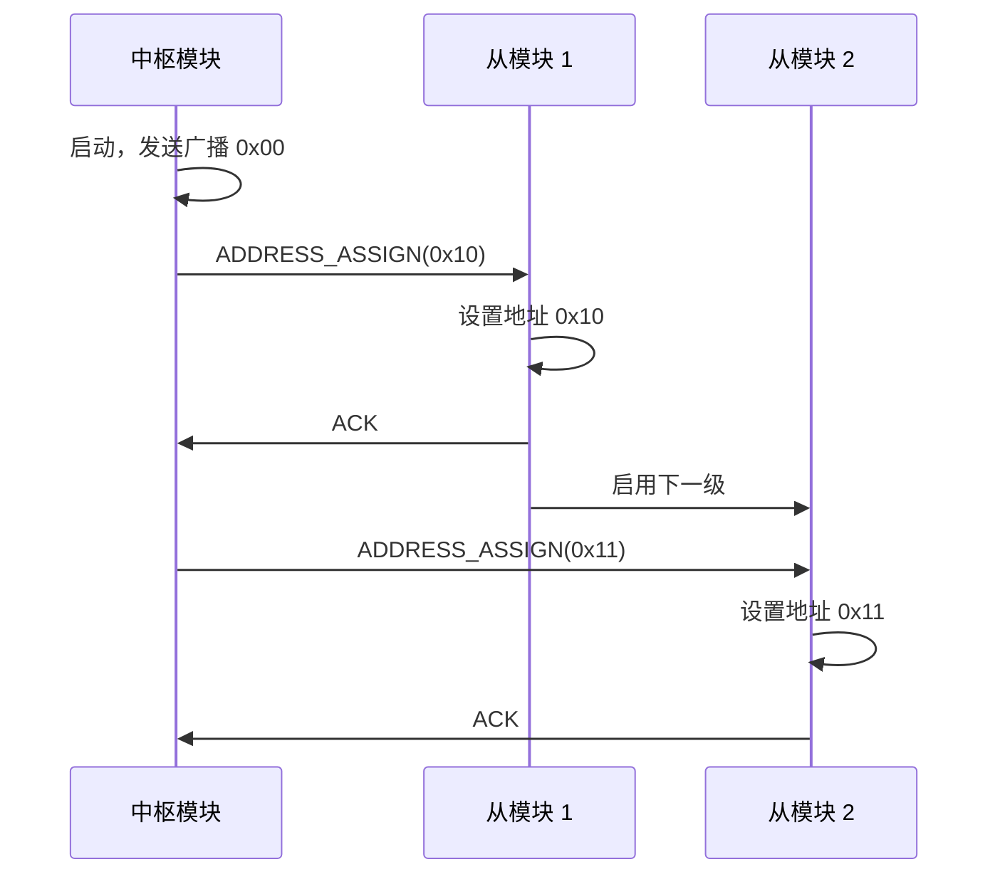

# Phase 2 架构更新计划
# 阿尔兹海默症智能药箱功能补充

**任务类型**: 架构文档更新（非代码实现）  
**基础版本**: Modular_Pillbox_Architecture_v1.md  
**目标**: 补充中枢模块、开盖检测、语音播报等关键功能设计

---

## 1. 兼容性分析结果

### ✅ Phase 1 架构保持不变的设计

基于对现有架构的分析，以下设计已在 v1 中得到充分验证，保持不变：

1. **模块化药盒设计**
   - 尺寸：100×60×25mm
   - 连接方式：Pogo Pin 磁吸连接（修正为 5 针，与文档一致）
   - 物理特性：3D 打印/注塑外壳

2. **供电方案**（已验证）
   - 12V 高压传输（解决电压降问题）
   - 每模块本地 LDO 降压到 3.3V
   - 组件：MT3608 升压、AMS1117-3.3 稳压

3. **LED 指示系统**（已验证）
   - WS2812B-Mini 可寻址 LED
   - 单 GPIO 控制无限级联
   - 5V 独立供电轨

4. **通信方案**（已验证）
   - I²C 总线（100kHz 标准模式）
   - 动态地址分配机制
   - 7-bit 地址空间（0x08-0x77）

5. **空间映射方案**（已验证）
   - "Blink to Identify" 手动认领
   - Philips Hue 式 UX
   - 约 10 秒/模块的映射时间

### ⚠️ 需要补充的核心功能

用户新增需求未在 Phase 1 中详细设计：

1. **系统角色分离**
   - Phase 1 假设：所有模块平等，ESP32-WROOM-32 作为网关
   - 新需求：明确区分中枢模块（Hub）和从模块（Slave）

2. **定时提醒系统**
   - 缺失：RTC 实时时钟方案
   - 缺失：定时任务管理架构
   - 缺失：5 分钟重复提醒逻辑

3. **语音播报系统**
   - 缺失：TTS 在线合成技术选型
   - 缺失：扬声器和功放电路
   - 缺失：音频输出方案（I2S/DAC）

4. **开盖检测机制**
   - 缺失：霍尔传感器选型和布局
   - 缺失：盖子磁铁集成设计
   - 缺失：开盖事件上报协议

5. **从模块智能化**
   - Phase 1 考虑：ATtiny85 或简单逻辑 IC（未定论）
   - 新需求明确：需要 ATtiny85 处理本地传感器
   - 新需求：I²C 从设备固件逻辑

---

## 2. 架构更新策略

### 2.1 中枢模块（Hub Module）设计

**职责扩展**：
```
Phase 1 定义的主控模块 → Phase 2 扩展为中枢模块
- 保留：WiFi 连接、I²C 主控、WS2812 驱动、12V 供电
- 新增：RTC 定时、TTS 语音播报、提醒流程管理
```

**新增硬件组件**：

| 组件 | 型号推荐 | 功能 | 成本估算 |
|------|---------|------|---------|
| **RTC 模块** | DS3231 或 PCF8523 | 精准计时，掉电保持 | $1.50 |
| **扬声器** | 3W 8Ω 小型扬声器 | 语音播放 | $0.80 |
| **音频功放** | PAM8403 (D 类功放) | 驱动扬声器 | $0.30 |
| **12V 适配器** | 2A 电源适配器 | 外部供电 | $3.00 |
| **音频连接** | I2S DAC 或 ESP32 内置 DAC | 数字转模拟 | $0 (内置) |

**外壳尺寸调整**：
- 长度：120mm（容纳扬声器音腔）
- 宽度：80mm
- 高度：40mm（扬声器需要空间）

**接口布局**：
- 左右两侧：Pogo Pin 母座（连接药盒）
- 顶部：扬声器格栅（透声孔）
- 后部：12V DC 插孔 + USB-C（调试）
- 底部：防滑垫 + 电源指示灯

### 2.2 从模块（Slave Module）更新

**Phase 1 状态回顾**：
- 决策记录 5（Appendix B）：ATtiny85 为"临时性决策"，需 Phase 3 验证
- BOM 中已包含 ATtiny85 ($0.45) + Door Sensor ($0.10)
- 但固件逻辑未详细设计

**Phase 2 明确设计**：

**新增硬件**：
| 组件 | 型号 | 功能 | 成本 |
|------|-----|------|-----|
| **MCU** | ATtiny85-20PU (8 引脚) | I²C 从设备 + GPIO 控制 | $0.60 |
| **霍尔传感器** | A3144 (开关型) | 检测盖子磁铁 | $0.15 |
| **盖子磁铁** | 5×1mm 钕磁铁 | 触发霍尔传感器 | $0.03 |

**引脚分配**（ATtiny85 仅 8 引脚）：
```
PB0 (Pin 5)  → WS2812 数据线输出
PB1 (Pin 6)  → 霍尔传感器输入（INPUT_PULLUP）
PB2 (Pin 7)  → I²C SDA
PB3 (Pin 2)  → 预留（未来扩展）
PB4 (Pin 3)  → 预留（未来扩展）
PB5 (Pin 1)  → I²C SCL
VCC (Pin 8)  → 3.3V 电源
GND (Pin 4)  → 地
```

**工作原理**：
1. ATtiny85 作为 I²C 从设备，监听主控命令
2. 霍尔传感器检测盖子状态（LOW=盖子关闭，HIGH=打开）
3. 状态变化时更新内部标志，等待主控轮询
4. 接收 LED 控制命令，驱动 WS2812

**外壳修改需求**：
- 顶盖内侧：增加直径 5.2mm × 深度 1.5mm 的磁铁孔
- PCB 布局：霍尔传感器位于顶盖下方中央，距离磁铁 3-5mm

### 2.3 I²C 通信协议详细设计

**地址自动分配（细化 Phase 1 方案）**：



**命令集设计**：

**中枢 → 从模块（控制命令）**：
| 命令 | 代码 | 数据格式 | 功能 |
|------|-----|---------|------|
| LED_ON | 0x01 | [R][G][B] | LED 常亮（RGB 值） |
| LED_OFF | 0x02 | - | LED 熄灭 |
| LED_BLINK | 0x03 | [速率] | LED 闪烁（1Hz/2Hz） |
| GET_STATUS | 0x04 | - | 请求状态 |
| RESET | 0xFF | - | 软重启 |

**从模块 → 中枢（状态上报）**：
| 状态字节 | 位定义 | 含义 |
|---------|-------|------|
| Bit 7 | 盖子状态 | 1=打开, 0=关闭 |
| Bit 6 | LED 状态 | 1=亮, 0=灭 |
| Bit 5-4 | 预留 | - |
| Bit 3-0 | 错误码 | 0=正常 |

**示例数据包**：
```
// 中枢命令：点亮地址 0x10 的 LED 为白色
[0x10][0x01][0xFF][0xFF][0xFF]

// 从模块应答：盖子已打开，LED 亮
[0x81]  // 0b10000001 = 盖子开 + LED 亮
```

### 2.4 软件架构设计

#### A. 中枢固件架构（ESP32）

**模块化设计**：
```cpp
// 主要功能模块
- RTC_Manager: DS3231 时钟管理
- Schedule_Engine: 定时任务调度
- TTS_Service: 在线语音合成
- I2C_Master: 从模块通信
- LED_Controller: WS2812 驱动
- Reminder_FSM: 提醒流程状态机
- Web_Server: RESTful API 服务
```

**提醒流程状态机**：
```
状态 1：空闲（Idle）
  └─ RTC 中断触发 → 状态 2

状态 2：播报提醒（Alert）
  ├─ TTS 播报"该吃药了"
  ├─ 点亮对应药盒 LED
  └─ 启动 5 分钟定时器 → 状态 3

状态 3：等待开盖（Waiting）
  ├─ 轮询 I²C 检测开盖事件
  ├─ 检测到开盖 → 状态 4（播报用量）
  └─ 定时器超时 → 状态 2（重复提醒）

状态 4：播报用量（Dosage）
  ├─ TTS 播报"请服用 X 粒"
  ├─ LED 熄灭
  └─ 所有药盒已开盖？→ 状态 5，否则 → 状态 3

状态 5：完成（Complete）
  ├─ TTS 播报"已完成用药"
  └─ 返回状态 1（空闲）
```

**TTS 在线合成方案**：

| 服务商 | API 接口 | 价格 | 音质 | 推荐度 |
|--------|---------|-----|------|-------|
| 百度 TTS | HTTP REST | ¥0.0034/次 | ★★★★ | ⭐⭐⭐⭐⭐ |
| 讯飞 TTS | WebSocket | ¥0.005/次 | ★★★★★ | ⭐⭐⭐⭐ |
| Azure TTS | REST | $0.016/1K 字符 | ★★★★★ | ⭐⭐⭐ |

**推荐方案**：百度 TTS
- 成本低（每次提醒约 ¥0.01）
- 支持中文自然语音
- HTTP 调用简单（适合 ESP32）

**实现伪代码**：
```cpp
void tts_speak(const char* text) {
    // 1. HTTPS 请求百度 TTS API
    String url = "https://tsn.baidu.com/text2audio";
    String params = "tex=" + urlencode(text) + "&tok=" + access_token;
    
    // 2. 接收 MP3 音频流
    HTTPClient http;
    http.begin(url);
    WiFiClient* stream = http.getStream();
    
    // 3. 通过 I2S 播放（ESP32 内置 DAC）
    i2s_write_mp3_stream(stream);
    
    // 4. 清理资源
    http.end();
}
```

#### B. 从模块固件架构（ATtiny85）

**核心逻辑**：
```c
#include <TinyWireS.h>  // I²C 从设备库
#include <Adafruit_NeoPixel.h>  // WS2812 库

#define I2C_ADDR 0x10  // 初始地址，启动后更新
#define HALL_PIN PB1
#define WS2812_PIN PB0

uint8_t lid_status = 0x00;  // 盖子状态
uint8_t led_mode = 0;       // LED 模式

void setup() {
    pinMode(HALL_PIN, INPUT_PULLUP);
    TinyWireS.begin(I2C_ADDR);
    TinyWireS.onReceive(i2c_receive_handler);
    TinyWireS.onRequest(i2c_request_handler);
    
    // WS2812 初始化
    strip.begin();
    strip.setBrightness(50);
}

void loop() {
    // 1. 检测盖子状态
    bool lid_open = (digitalRead(HALL_PIN) == HIGH);
    if (lid_open != (lid_status & 0x80)) {
        lid_status = lid_open ? 0x81 : 0x00;
    }
    
    // 2. 更新 LED 状态
    if (led_mode == 1) {  // 常亮
        strip.setPixelColor(0, strip.Color(255, 255, 255));
    } else if (led_mode == 2) {  // 熄灭
        strip.setPixelColor(0, 0);
    } else if (led_mode == 3) {  // 闪烁
        strip.setPixelColor(0, millis() % 1000 < 500 ? 255 : 0);
    }
    strip.show();
    
    // 3. 处理 I²C 事件
    TinyWireS_stop_check();
}

void i2c_receive_handler(uint8_t num_bytes) {
    uint8_t cmd = TinyWireS.receive();
    switch (cmd) {
        case 0x01:  // LED_ON
            led_mode = 1;
            break;
        case 0x02:  // LED_OFF
            led_mode = 2;
            break;
        case 0x03:  // LED_BLINK
            led_mode = 3;
            break;
    }
}

void i2c_request_handler() {
    TinyWireS.send(lid_status);  // 返回状态
}
```

#### C. UI 前端架构

**技术栈选择**：
- **框架**：React 18 + TypeScript
- **状态管理**：Zustand（轻量级）
- **实时通信**：WebSocket（双向推送）
- **UI 库**：Ant Design Mobile（响应式）
- **构建工具**：Vite

**核心页面设计**：

1. **网格布局页（Grid Layout）**
```
┌─────────────────────────────────┐
│  阿尔兹海默症智能药箱            │
├─────────────────────────────────┤
│                                 │
│      ┌───┐    ┌───┐            │
│      │🟢 │ ← 中枢模块            │
│      └───┘    └───┘            │
│   ┌───┐ ┌───┐ ┌───┐           │
│   │🔴 │ │🟢 │ │🔵?│           │
│   │M1 │ │M2 │ │新 │           │
│   └───┘ └───┘ └───┘           │
│                                 │
│  🔵 检测到新药盒！               │
│  点击上方模块位置进行绑定         │
└─────────────────────────────────┘

图例：
🟢 = 已绑定且正常
🔴 = 需要吃药（LED 亮）
🔵 = 未绑定（闪烁）
```

2. **药盒管理页（Medication Manager）**
```jsx
// 伪代码
<List>
  <ListItem 
    title="降压药"
    description="每日 08:00, 20:00"
    extra="2 粒/次"
    status={isOpen ? "已开盖" : "待服用"}
  />
  <ListItem 
    title="阿司匹林"
    description="每日 09:00"
    extra="1 粒/次"
    status="已完成"
  />
</List>
```

3. **提醒历史页（History）**
```
2026-03-02
✓ 08:00 降压药 - 已服用
✓ 09:00 阿司匹林 - 已服用
⏰ 20:00 降压药 - 待服用

2026-03-01
✓ 08:00 降压药 - 已服用
⚠️ 09:00 阿司匹林 - 未服用（超时）
```

**RESTful API 设计**：

| 方法 | 端点 | 功能 |
|-----|------|-----|
| GET | /api/boxes | 获取所有药盒状态 |
| POST | /api/boxes/{id}/bind | 绑定药盒到位置 |
| PUT | /api/boxes/{id}/schedule | 设置提醒时间 |
| PUT | /api/boxes/{id}/dosage | 设置用法用量 |
| GET | /api/history?date=YYYY-MM-DD | 查询历史记录 |
| POST | /api/tts/test | 测试语音播报 |

---

## 3. BOM 成本更新

### 3.1 中枢模块 BOM（新增）

基于 Phase 1 主控模块（$10.05）增加：

| 新增组件 | 型号 | 数量 | 单价 | 小计 |
|---------|-----|-----|------|-----|
| RTC 模块 | DS3231 | 1 | $1.50 | $1.50 |
| 扬声器 | 3W 8Ω | 1 | $0.80 | $0.80 |
| 功放芯片 | PAM8403 | 1 | $0.30 | $0.30 |
| 功放外围（电容等） | - | - | - | $0.20 |
| 12V 电源适配器 | 2A | 1 | $3.00 | $3.00 |
| 音频接线端子 | - | 1 | $0.10 | $0.10 |
| **新增成本合计** | | | | **$5.90** |

**中枢模块总成本**：$10.05 + $5.90 = **$15.95**

### 3.2 从模块 BOM（更新）

Phase 1 从模块（$6.49）更新：

| 组件变更 | Phase 1 | Phase 2 | 差价 |
|---------|---------|---------|-----|
| MCU | ATtiny85 $0.45 | ATtiny85 $0.60 | +$0.15 |
| 传感器 | Reed switch $0.10 | A3144 霍尔 $0.15 | +$0.05 |
| 盖子磁铁 | - | 5×1mm $0.03 | +$0.03 |
| **总变更** | | | **+$0.23** |

**更新后从模块成本**：$6.49 + $0.23 = **$6.72**

### 3.3 10 模块系统总成本

| 项目 | 数量 | 单价 | 小计 |
|-----|-----|------|-----|
| 中枢模块 | 1 | $15.95 | $15.95 |
| 从模块 | 9 | $6.72 | $60.48 |
| **系统 BOM** | | | **$76.43** |
| 包装文档 | | | $5.00 |
| **总成本** | | | **$81.43** |

**对比 Phase 1**：$73.46 → $81.43（+$7.97，+10.8%）

---

## 4. 技术风险评估

### 新增风险

| 风险 ID | 描述 | 概率 | 影响 | 缓解措施 |
|--------|------|-----|------|---------|
| **R9** | 霍尔传感器误触发（磁场干扰） | 中（40%） | 中 | 使用开关型 A3144，设置 3-5mm 检测距离 |
| **R10** | TTS 延迟（网络依赖） | 高（60%） | 中 | 预缓存常用语音，离线播报 |
| **R11** | ATtiny85 I²C 库兼容性 | 低（20%） | 高 | 使用成熟 TinyWireS 库，提前验证 |
| **R12** | 音频功放噪声 | 中（30%） | 低 | PCB 隔离数字/模拟地，滤波电容 |
| **R13** | RTC 断电时钟漂移 | 低（15%） | 中 | DS3231 带温补，±2ppm 精度 |

### Phase 1 已有风险状态更新

| 原 ID | 描述 | Phase 2 状态 |
|------|------|------------|
| R1 | LDO 过热 | ✅ 已确认热设计方案 |
| R2 | WS2812 长链信号 | ✅ 30 模块可行 |
| R3 | I²C 热插拔 | ⚠️ 需实测 ATtiny85 响应 |
| R5 | Pogo Pin 氧化 | ✅ 已选工业级 1.5μm 镀金 |

---

## 5. 文档交付清单

### 5.1 主架构文档更新

**文件**：`Modular_Pillbox_Architecture_v2.md`

**新增章节**：
- **2.5 系统角色架构**
  - 2.5.1 中枢模块（Hub）职责
  - 2.5.2 从模块（Slave）职责
  - 2.5.3 角色通信模型

- **3.6 开盖检测方案**
  - 3.6.1 霍尔传感器选型（A3144）
  - 3.6.2 磁铁布局设计
  - 3.6.3 检测距离校准

- **3.7 语音播报方案**
  - 3.7.1 TTS 在线合成（百度/讯飞对比）
  - 3.7.2 扬声器和功放电路
  - 3.7.3 音频输出方案（I2S）

- **6.2 从模块 ATtiny85 固件逻辑**
  - 6.2.1 引脚分配
  - 6.2.2 I²C 从设备实现
  - 6.2.3 霍尔传感器轮询
  - 6.2.4 WS2812 控制

- **6.3 中枢 ESP32 提醒流程**
  - 6.3.1 状态机设计
  - 6.3.2 RTC 中断处理
  - 6.3.3 TTS 合成调用
  - 6.3.4 I²C 轮询机制

- **7. UI 前端设计**（新章节）
  - 7.1 技术栈选择
  - 7.2 页面结构
  - 7.3 RESTful API 规范
  - 7.4 WebSocket 实时推送

- **BOM 表更新**
  - 中枢模块完整清单
  - 从模块更新清单
  - 系统总成本对比

### 5.2 中枢模块详细规范

**文件**：`Hub_Module_Specification.md`

**内容大纲**：
1. 硬件规范
   - 组件清单
   - 原理图要点
   - PCB 布局建议
   - 外壳尺寸图

2. 软件架构
   - 固件模块划分
   - 状态机详细设计
   - TTS 集成方案
   - RTC 时间同步

3. 接口定义
   - Pogo Pin 引脚定义
   - I²C 主控协议
   - WiFi 配置流程
   - USB 调试接口

4. API 规范
   - RESTful 端点列表
   - WebSocket 消息格式
   - 错误码定义

### 5.3 完整 BOM 清单

**文件**：`Phase2_Complete_BOM.md`

**内容结构**：
1. 中枢模块 BOM
   - 电子元件清单
   - 机械件清单
   - 成本分析

2. 从模块 BOM（更新版）
   - 与 Phase 1 差异对比
   - 成本增量分析

3. 系统配置方案
   - 5 模块配置（入门）
   - 10 模块配置（标准）
   - 20 模块配置（高级）

4. 量产成本预测
   - 100 件批量成本
   - 1,000 件批量成本
   - 10,000 件批量成本

---

## 6. 下一步行动

### 立即行动（本次任务）
- [x] 完成兼容性分析
- [-] 撰写 Modular_Pillbox_Architecture_v2.md
- [ ] 撰写 Hub_Module_Specification.md
- [ ] 撰写 Phase2_Complete_BOM.md
- [ ] 提交完成确认

### 后续阶段（Phase 3 实施）
- [ ] 中枢模块原理图设计
- [ ] ATtiny85 固件开发
- [ ] ESP32 主固件开发
- [ ] UI 前端开发
- [ ] 整机集成测试

---

## 7. 设计原则确认

✅ **与 Phase 1 架构兼容**：所有新增功能基于现有设计扩展  
✅ **技术一致性**：继续使用 WS2812、I²C、12V 供电等已验证方案  
✅ **成本可控**：系统成本增幅 10.8%，在合理范围内  
✅ **风险可控**：新增风险均有缓解措施  
✅ **仅文档输出**：本次不涉及代码或建模  

---

**文档版本**: Plan v1.0  
**创建日期**: 2026-03-02  
**状态**: 已完成分析，准备文档撰写
